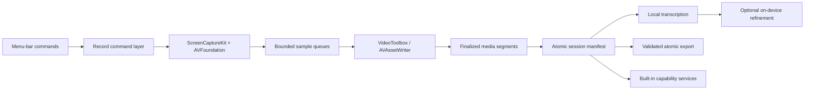
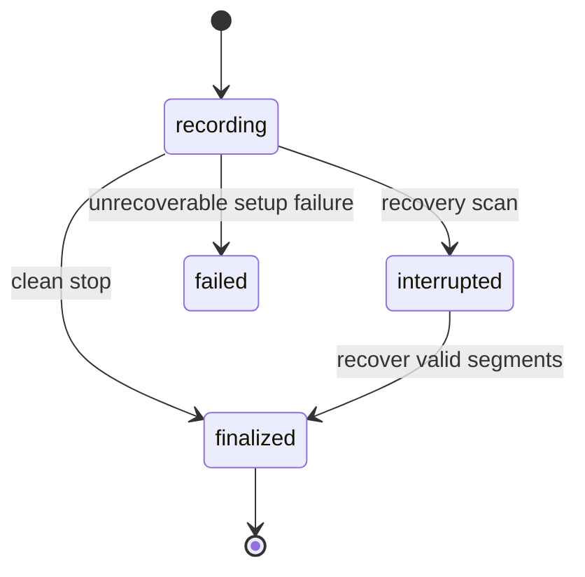

# Architecture

## Goals

Record is a menu-bar-first macOS application that captures high-quality media
without making the recording pipeline depend on the editor, transcription, or
plugins. The raw session remains recoverable when any downstream component
fails.

## Modules

- `RecordCore`: versioned configuration, session manifests, commands, edit
  operations, model identifiers, and plugin lifecycle state.
- `RecordCapture`: ScreenCaptureKit source resolution, bounded stream
  configuration, microphone/system-audio routing, raw timestamp validation,
  cursor/click settings, and the future camera adapter.
- `RecordMedia`: bounded queues, Metal composition, hardware encoding,
  segmentation, muxing, and non-destructive export.
- `Record` application target: AppKit menu-bar UI, local transcription
  adapters, built-in plugin services, signed updates, and login registration.
- `record`: diagnostic and automation CLI sharing the same command layer.

`RecordCore` owns typed capture configuration and the pure command/effect
lifecycle. `RecordCapture` translates those types into ScreenCaptureKit without
duplicating session state. `RecordMedia` owns the bounded asynchronous handoff,
common media timeline, and independently finalized hardware-encoded segments.
Future source pickers, editing, camera, and out-of-process extensions must
preserve those boundaries rather than moving mutable state into the menu layer.

## Application services

Sparkle's standard updater owns one silent signed GitHub feed check at launch
and the manual fallback. `RecordCore` holds the deterministic launch-check
policy; the app adapter alone calls Sparkle. Its downloader and installer run
in the framework's sandboxed XPC services, while the main Record process retains
no network entitlement. Automatic installation and system profiling remain
disabled. `SMAppService.mainApp` owns optional login registration, so Record
does not install a custom LaunchAgent.

## Session format

Each current session is a directory containing an atomically updated
`session.json`, independently finalized source media, optional local
transcripts, and bounded diagnostic logs. Source media remains immutable.
Future trimming, speed changes, masks, camera placement, and annotations must
be stored as non-destructive edit operations rather than rewriting that source.

Optional transcript refinement follows the same rule. `RecordCore` plans a
bounded set of filled-pause and immediate-repeat candidates, detects
cross-speaker time overlap, validates advisory decisions, and applies only
whole-token removals. The app adapter uses Apple's Foundation Models framework
on supported Macs but cannot rewrite text, timing, or speaker labels. Any
change preserves the complete pre-refinement transcript in
`transcript.raw.json`; `transcript.refinement.json` binds a content-free audit
record to that source with SHA-256. `transcript.json` remains the atomic
completion marker. Speaker diarization and identity inference are outside this
pass.

The current screen-capture segment is deliberately split into
`recording.mov`, `system.caf`, and `mic.caf`. The movie contains video only;
each audio source remains independently playable and addressable in the
manifest. All writers share the same capture-clock anchor, and the manifest
stores each track's start offset for downstream transcription and editing.
Audio callbacks copy into fixed-capacity queues; conversion, encoding, and
filesystem writes stay off those callbacks. Content-free `capture_health`
events in the manifest record missing callbacks, digital silence, route
recovery, voice-processing fallback, queue pressure, and write failure without
device names or samples. Default-input changes restart the microphone graph
into the same file, with silence representing the route gap so elapsed time
does not collapse. A post-restart callback watchdog ignores the engine's own
settling notification and falls back once to raw input when VoiceProcessingIO
cannot remain live on the new route.
Each screen-recording interval first closes into immutable
`segment-NNNN.mov`, `segment-NNNN-system.caf`, and `segment-NNNN-mic.caf`
working files. Pause finalizes the active interval; resume creates fresh
writers and a fresh ScreenCaptureKit stream from the same in-memory selection.
The atomic manifest journals start, pause, resume, and stop events before a
transition can expose new media. Finalization concatenates compatible HEVC
segments with AVFoundation passthrough and retimes existing AAC packets into
the canonical CAF files without decoding or re-encoding. Raw segments remain
until the complete exported directory validates.
During capture this directory lives in private crash-recovery storage. A clean
stop promotes the complete directory through an atomic copy/rename into the
approved export root, then removes only the validated finalized private child.
Transcription, notification navigation, and downstream handoffs use the
promoted directory. Failed or unexported sessions remain private.
On startup, playable hidden partials are promoted when their declared target is
missing. Invalid partial containers move intact to `Recovery/Corrupt Media`;
Record never truncates or deletes those bytes during recovery.

State transitions are explicit:

## Performance design

- Keep capture callbacks nonblocking and allocation-light.
- Use bounded queues with measured backpressure and explicit drop accounting.
- Prefer IOSurface/CVPixelBuffer handoff and hardware VideoToolbox encoding.
- Load transcription models only while work exists and release them afterward.
- Instrument frame latency, queue depth, encoder stalls, A/V drift, segment
  finalization, and memory pressure with signposts.
- Never re-encode merely to pause, resume, recover, or concatenate compatible
  segments.

Long-duration and 4K60 acceptance gates remain roadmap criteria for source and
frame-rate controls. Current release gates exercise the implemented 30 fps main
display path plus independent audio tracks and recovery states.

## DRY boundaries

UI, CLI, shortcuts, and plugins issue the same typed commands. The session
manifest is the sole canonical session state. CI invokes repository scripts
that developers can run locally; workflow YAML does not duplicate build or
packaging commands. Release accepts full build/test/package evidence only from
the exact successful `main` commit, then reuses the provenance-attested unsigned
app that CI already exercised instead of compiling the same production binary
twice.
