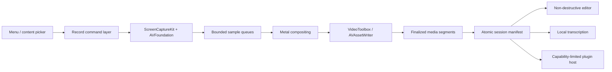
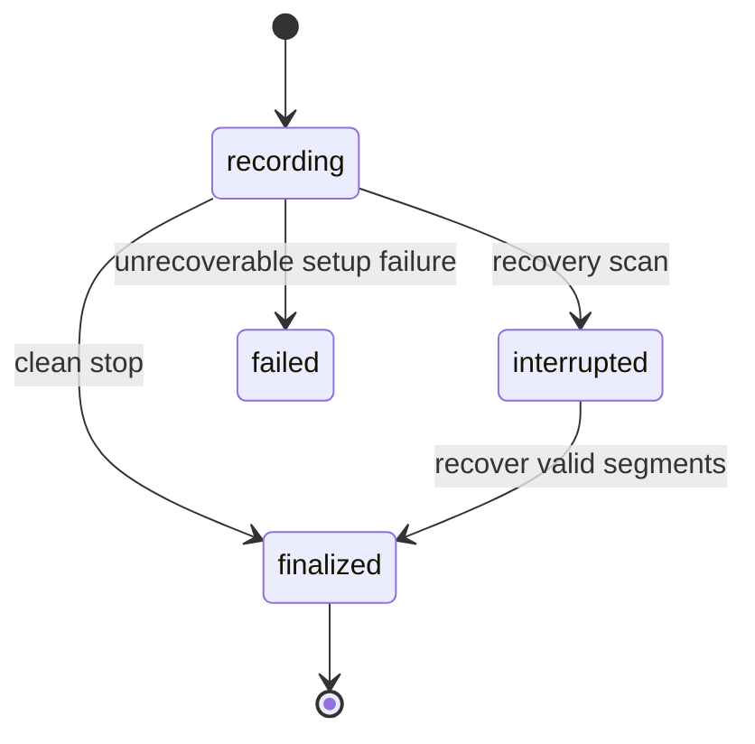

# Architecture

## Goals

Record is a menu-bar-first macOS application that captures high-quality media
without making the recording pipeline depend on the editor, transcription, or
plugins. The raw session remains recoverable when any downstream component
fails.

## Modules

- `RecordCore`: versioned configuration, session manifests, commands, edit
  operations, model identifiers, and plugin lifecycle state.
- `RecordCapture`: ScreenCaptureKit source resolution, bounded stream
  configuration, microphone/system-audio routing, raw timestamp validation,
  cursor/click settings, and the future camera adapter.
- `RecordMedia`: bounded queues, Metal composition, hardware encoding,
  segmentation, muxing, and non-destructive export.
- `RecordTranscription`: local engines and transcript merge behavior.
- `RecordPlugins`: built-in services and the future out-of-process host.
- `RecordUI`: AppKit status item and SwiftUI picker, settings, history, and
  editor.
- `record`: diagnostic and automation CLI sharing the same command layer.

`RecordCore` owns typed capture configuration and the pure command/effect
lifecycle. `RecordCapture` translates those types into ScreenCaptureKit without
duplicating session state. `RecordMedia` owns the bounded asynchronous handoff,
common media timeline, and independently finalized hardware-encoded segments.
The remaining modules are migration targets and must preserve those boundaries.

## Session format

Each session is a directory containing an atomically updated `session.json`,
append-only diagnostic events, short finalized raw segments, derived exports,
and transcripts. Raw segments are immutable. Trimming, speed changes, masks,
camera placement, and annotations are stored as edit operations so exporting
never destroys the source.

The current screen-capture segment is deliberately split into
`recording.mov`, `system.caf`, and `mic.caf`. The movie contains video only;
each audio source remains independently playable and addressable in the
manifest. All writers share the same capture-clock anchor, and the manifest
stores each track's start offset for downstream transcription and editing.

State transitions are explicit:

## Performance design

- Keep capture callbacks nonblocking and allocation-light.
- Use bounded queues with measured backpressure and explicit drop accounting.
- Prefer IOSurface/CVPixelBuffer handoff and hardware VideoToolbox encoding.
- Load transcription models only while work exists and release them afterward.
- Instrument frame latency, queue depth, encoder stalls, A/V drift, segment
  finalization, and memory pressure with signposts.
- Never re-encode merely to pause, resume, recover, or concatenate compatible
  segments.

Reference acceptance gates include a 30-minute 4K60 recording without
sustained dropped frames, less than 50 ms A/V drift over one hour, and recovery
from forced termination at every session phase.

## DRY boundaries

UI, CLI, shortcuts, and plugins issue the same typed commands. The session
manifest is the sole canonical session state. CI invokes repository scripts
that developers can run locally; workflow YAML does not duplicate build or
packaging commands.
