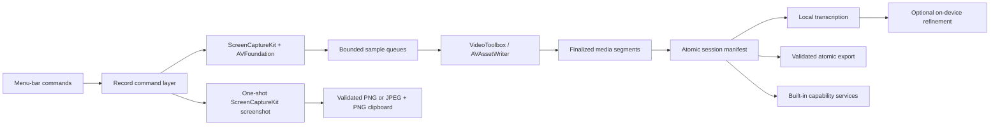
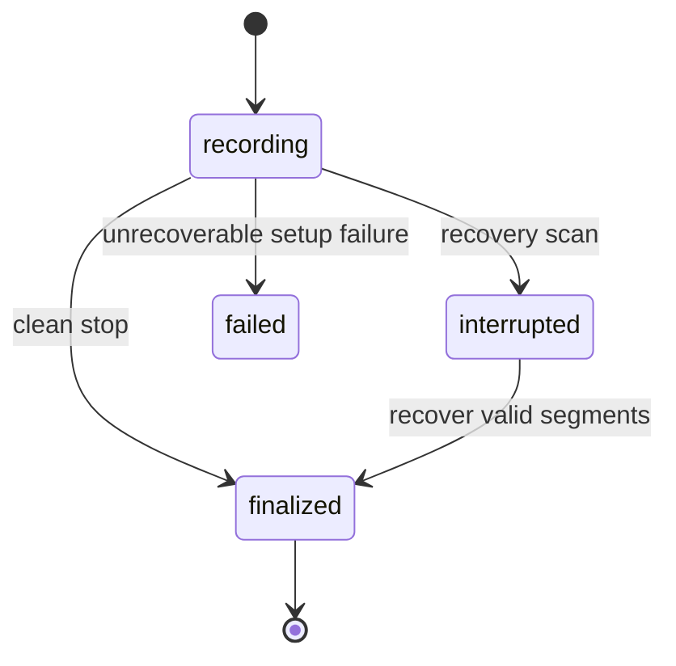

# Architecture

## Goals

Record is a menu-bar-first macOS application that captures high-quality media
without making the recording pipeline depend on the editor, transcription, or
plugins. The raw session remains recoverable when any downstream component
fails.

Reusable speech, Apple generation, diagnostics, and update mechanics come from
the Swift packages in `shared/dust-wave-platform`. Record owns capture,
transcript cleanup policy, UI, and local storage. The module boundaries are
documented in [ADR 0022](adr/0022-platform-native-speech.md) and
[ADR 0024](adr/0024-platform-desktop-updates.md).

```mermaid
flowchart LR
    Menu["Menu-bar commands"] --> Command["Record command layer"]
    Command --> Capture["ScreenCaptureKit + AVFoundation"]
    Capture --> Buffers["Bounded sample queues"]
    Buffers --> Encode["VideoToolbox / AVAssetWriter"]
    Encode --> Segments["Finalized media segments"]
    Segments --> Session["Atomic session manifest"]
    Session --> Transcript["Local transcription"]
    Transcript --> Refine["Optional on-device refinement"]
    Session --> Export["Validated atomic export"]
    Session --> Plugins["Built-in capability services"]
    Command --> Still["One-shot ScreenCaptureKit screenshot"]
    Still --> Image["Validated PNG or JPEG + PNG clipboard"]
```

## Modules

- `RecordCore`: versioned configuration, session manifests, commands,
  screenshot formats/shortcuts/filenames, model identifiers, and capability
  lifecycle state.
- `RecordCapture`: ScreenCaptureKit source resolution, bounded stream
  configuration, microphone/system-audio routing, raw timestamp validation,
  and cursor/click settings.
- `RecordMedia`: bounded queues, a shared media timeline, hardware encoding,
  segment writing, and passthrough concatenation.
- `RecordSpeech`: compatibility exports for shared speech adapters; the app
  owns transcription scheduling, cleanup policy, and local session outputs.
- `RecordModelDownload`: the fixed GitHub endpoint, redirect restriction,
  bounded retry/resume, and archive verification used only by the bundled
  model-downloader XPC service.
- `Record` executable target, shipped as `record` inside the app: AppKit menu-bar
  and unified settings UI, local
  transcription adapters, screenshot hotkeys/export/clipboard feedback,
  built-in capability services, signed updates, login registration, App Intents,
  and the diagnostic/transcription/recording-control CLI.
- `RecordModelDownloaderService` and `RecordReportSenderService`: separately
  sandboxed XPC executables for the two fixed network operations described below.

`RecordCore` owns typed capture configuration and the pure command/effect
lifecycle. `RecordCapture` translates those types into ScreenCaptureKit without
duplicating session state. `RecordMedia` owns the bounded asynchronous handoff,
common media timeline, and independently finalized hardware-encoded segments.
Future editing, camera, and out-of-process extensions must preserve those
boundaries rather than moving mutable state into the menu layer.

## Application services

Sparkle's standard updater owns one silent signed GitHub feed check at launch
and the manual fallback. `RecordCore` exposes the shared deterministic launch-check
policy; the app adapter alone calls Sparkle. Its downloader and installer run
in the framework's sandboxed XPC services, while the main Record process retains
no network entitlement. Automatic installation and system profiling remain
disabled. `SMAppService.mainApp` owns optional login registration, so Record
does not install a custom LaunchAgent.

Parakeet setup uses a second, independent sandboxed XPC service. The main app
creates a private temporary file and passes only its open file descriptor. The
helper chooses the compile-time-pinned GitHub asset itself, follows HTTPS
redirects only within GitHub-controlled hosts, verifies its exact byte count
and SHA-256, and writes the verified bytes through that descriptor. It receives
no URL, local path, recording data, transcript, or diagnostic. The main app
then repeats archive verification, expands into private temporary storage, and
reuses the existing per-file manifest validation and atomic installer. The
main app retains no network entitlement, and FluidAudio remains forced offline.

Help & diagnostics offers preview, crash-summary import, local save, and explicit
send. `RecordCore` owns the closed `record-diagnostic-v1` schema, canonical
validation, and XPC protocol. Shared diagnostic utilities provide crash
projection, bounded transport, and acknowledgements. The UI persists
only the filtered pending report, keeps retries on the same ID, and defers manual
update checks during sending. `RecordReportSender.xpc` accepts only validated JSON
and chooses its fixed endpoint. The reporting service validates Record's schema,
groups matching reports, and publishes them to Record's public issue tracker.
See [ADR 0025](adr/0025-reviewed-diagnostics.md).

## Session format

Screenshots deliberately do not create sessions or manifests. A one-shot
capture is encoded off the main actor, validated, and atomically published
directly into the same user-approved export root as finished recording
sessions. Clipboard publication is a separate outcome and always uses lossless
PNG bytes, even when disk export is JPEG. The system picker filter and custom
area geometry remain memory-only. One explicit own-application policy keeps the
shared resolver DRY: recording filters exclude Record, while screenshot filters
include Record after any selection overlay is dismissed. Permission routing is
likewise command-specific: direct display/area capture requests broad screen
access, while window/application capture uses Apple's selection-scoped picker.

Each current session is a directory containing an atomically updated
`session.json`, independently finalized source media, optional local
transcripts, and bounded diagnostic logs. Source media remains immutable.
Future trimming, speed changes, masks, camera placement, and annotations must
be stored as non-destructive edit operations rather than rewriting that source.

Optional transcript refinement follows the same rule. `RecordCore` plans a
bounded set of filled-pause and immediate-repeat candidates, detects
cross-speaker time overlap, validates advisory decisions, and applies only
whole-token removals. The app adapter uses Apple's Foundation Models framework
on supported Macs but cannot rewrite text, timing, or speaker labels. New
transcription preserves original recognition in `transcript.raw.json` before
echo suppression and cleanup. `transcript.refinement.json` binds a content-free
cleanup audit to the raw transcript with SHA-256. Speaker diarization and identity
inference are outside this pass.

Vocabulary runs after cleanup. `transcript.cleaned.json` preserves the
pre-vocabulary document; `transcript.vocabulary.json` records its hash and changed
segments. The final `transcript.json` and `transcript.md` may contain partial
results, explicitly marked with incomplete tracks. The per-track checkpoint in
`transcription.state.json` reaches `complete` only after every requested track
succeeds and outputs are written. File existence alone is not a completion test.
Retry reuses successful recognition only when the source and recognition settings
match. Reapplying vocabulary uses the preserved baseline without recognizing again.

Finalized recordings contain video-only `recording.mov` for screen capture and
24-bit PCM `system.wav` and/or `mic.wav` for the enabled audio sources. Each remains
independently playable and addressable in the manifest. All writers share the
same capture-clock anchor, and the manifest stores each track's start offset
for downstream transcription and editing.
Audio callbacks copy into fixed-capacity queues; conversion, encoding, and
filesystem writes stay off those callbacks. Content-free `capture_health`
events in the manifest record missing callbacks, digital silence, route
recovery, voice-processing fallback, queue pressure, and write failure without
device names or samples. Default-input changes restart the microphone graph
into the same file, with silence representing the route gap so elapsed time
does not collapse. A post-restart callback watchdog ignores the engine's own
settling notification and falls back once to raw input when VoiceProcessingIO
cannot remain live on the new route.
Capture remains crash-resilient by writing AAC/CAF audio privately. Each
screen-recording interval first closes into immutable `segment-NNNN.mov`,
`segment-NNNN-system.caf`, and `segment-NNNN-mic.caf` working files. Pause
finalizes the active interval; resume creates fresh writers and a fresh
ScreenCaptureKit stream from the same in-memory selection. The atomic manifest
journals start, pause, resume, and stop events before a transition can expose
new media. Finalization concatenates compatible HEVC segments with AVFoundation
passthrough, retimes existing AAC packets into private assembled CAF files, and
then uses one shared adapter to decode each completed audio source into an
atomic 24-bit PCM WAV at its captured sample rate and channel layout. Raw CAF
sources and segments remain until the complete exported directory validates.
During capture this directory lives in private crash-recovery storage. A clean
stop promotes the complete directory through an atomic copy/rename into the
approved export root, then removes only the validated finalized private child.
Transcription, notification navigation, and downstream handoffs use the
promoted directory. Failed or unexported sessions remain private.
On startup, playable hidden partials are promoted when their declared target is
missing. Invalid partial containers move intact to `Recovery/Corrupt Media`;
Record never truncates or deletes those bytes during recovery.

Imported audio sessions contain an owned, validated `source.<extension>` copy
and provenance in the manifest; originals remain untouched. Schema 3 adds an
explicit dictation purpose to microphone-only sessions and continues to read older
schemas. Dictation and imports use the same transcription queue as recordings.
Startup and model-setup completion scan private recovery storage and the current
save folder for pending transcription. Deferred sessions stay deferred, and the
export scan does not repair interrupted capture manifests.

State transitions are explicit:

```mermaid
stateDiagram-v2
    [*] --> recording
    recording --> finalized: clean stop
    recording --> interrupted: recovery scan
    recording --> failed: unrecoverable setup failure
    interrupted --> finalized: recover valid segments
    finalized --> [*]
```

## Performance design

- Keep capture callbacks nonblocking and allocation-light.
- Use bounded queues with measured backpressure and explicit drop accounting.
- Prefer IOSurface/CVPixelBuffer handoff and hardware VideoToolbox encoding.
- Load transcription models only while work exists and release them afterward.
- Instrument frame latency, queue depth, encoder stalls, A/V drift, segment
  finalization, and memory pressure with signposts.
- Never re-encode merely to pause, resume, recover, or concatenate compatible
  segments.
- Perform the requested PCM WAV conversion only after capture has stopped and
  outside capture callbacks.

Long-duration and 4K60 acceptance gates remain roadmap criteria for future
frame-rate controls. Current release gates exercise the implemented 30 fps
display/window/application/region paths plus independent audio tracks and
recovery states.

## DRY boundaries

UI, CLI, shortcuts, and plugins issue the same typed commands. The session
manifest owns capture and media state; the transcription checkpoint owns per-track
recognition progress, retry, and defer state. CI invokes repository scripts
that developers can run locally; workflow YAML does not duplicate build or
packaging commands. Release accepts full build/test/package evidence only from
the exact successful `main` commit, then reuses the provenance-attested unsigned
app that CI already exercised instead of compiling the same production binary
twice. Documentation-only changes use the shared offline validation path in
[ADR 0018](adr/0018-documentation-only-validation.md); they produce no app
artifact. Release still requires full build and security jobs on its exact
commit, including manual runs when needed.

`RecordCore` also owns the canonical capture/finalized media layout and the
shared real-file metadata policy. Capture, media, recovery, inspection,
transcription, export, and handoff adapters add only their format- or
capability-specific checks. The AppKit menu applies one complete presentation
value for each recording phase so a transition cannot inherit stale command
availability from a previous phase.

Persistent preferences use one settings window with General, Recording, Sessions,
Transcription, Screenshots, and Shortcuts sections. The menu remains an operational surface: it keeps capture,
source-selection, open/retry, update, and quit commands. Settings adapters reuse
the existing preference stores, security-scoped export bookmark, and recording
presentation policy rather than creating parallel state or grants.

Screen recording and screenshots share one ScreenCaptureKit content resolver,
one Apple picker adapter, one custom-area overlay, and one capture-privacy
configuration. Still-image sizing is a separate pure contract because native
screenshots must not inherit the recording writer's 4K/even-dimension bound.
Global hotkeys translate into the same screenshot, recording-toggle,
dictation-toggle, and screen pause/resume commands used by the menu. Carbon
registration avoids an Accessibility permission request.

Quick Dictation is an existing microphone recording session with a schema-3
purpose, followed by the same transcription queue and an explicit-copy preview.
CLI recording commands and five App Intents share the deterministic RecordCore
command policy and AppController capture owner. The CLI uses bounded fixed files
in the private app cache; no network entitlement or public URL handler is added.
See [ADR 0028](adr/0028-dictation-and-local-recording-control.md).
