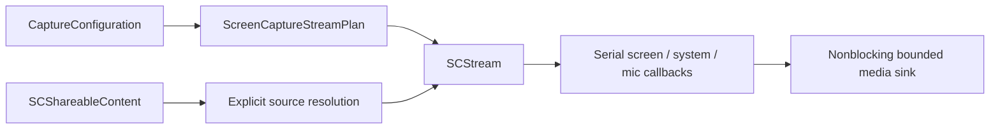

# ScreenCaptureKit adapter

`RecordCapture` is the native boundary between pure capture commands in
`RecordCore` and macOS ScreenCaptureKit. It prepares streams but does not own
session manifests, media writing, editing, or UI state.

## Decisions

- Application filters include an explicit display identifier because
  ScreenCaptureKit application filters are display-scoped. Record never picks
  a main display as a silent fallback.
- Region rectangles use display-local logical points and must fit entirely
  inside the selected display.
- The WindowServer frame queue is fixed at five frames and validated within
  `3...8`. Downstream media queues must also be bounded; the adapter never
  creates one `Task` per sample.
- SDR capture defaults to 4:2:0 video-range BT.709 for direct hardware-encoder
  handoff. Native click highlighting selects BGRA because ScreenCaptureKit
  applies that effect only to BGRA frames.
- System and microphone samples come from the same `SCStream` on macOS 15.
  Their original presentation timestamps are retained and checked for
  monotonicity independently. The media writer will choose the shared A/V
  session anchor.
- Display and region filters exclude Record itself when ScreenCaptureKit can
  identify it, preventing a hall-of-mirrors capture. Window and application
  filters capture only the explicitly selected source.
- Stop is idempotent. A stop requested while `startCapture()` is suspended
  waits for start to finish, stops exactly once, and releases all outputs.
- The macOS native stop-sharing control emits a typed stop request so the
  command layer finalizes normally; it is not misclassified as source failure.

The adapter uses Apple's recommended native content and stream APIs:
[ScreenCaptureKit](https://developer.apple.com/documentation/screencapturekit),
[SCStreamConfiguration](https://developer.apple.com/documentation/screencapturekit/scstreamconfiguration),
and the macOS capture
[sample](https://developer.apple.com/documentation/screencapturekit/capturing-screen-content-in-macos).

## Callback contract

`ScreenCaptureSampleSink.consume` runs synchronously on one of three dedicated
serial queues. It must retain/enqueue the sample and return immediately. Slow
encoding, disk I/O, UI work, logging, and unbounded allocation are prohibited
on these callbacks.

Only complete/started screen frames with valid, non-regressive presentation
timestamps reach the sink. Invalid timestamp sequences produce one sanitized
failure event rather than repeated logs containing private source details.

## Current limits

- The adapter is not yet connected to the menu or existing audio-only daemon.
- `RecordMedia` provides the bounded sample handoff and common A/V anchor; it
  still needs the VideoToolbox/AVAssetWriter path and crash-safe segments.
- Camera capture/compositing and the system content-sharing picker are separate
  follow-up slices.
- Hardware/TCC validation is intentionally not part of ordinary CI. It must
  use synthetic, non-sensitive content on the dedicated matrix in
  `docs/testing.md`.
