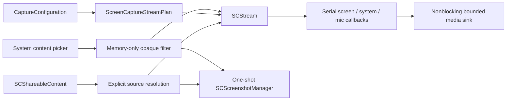

# ScreenCaptureKit adapter

`RecordCapture` is the native boundary between pure capture commands in
`RecordCore` and macOS ScreenCaptureKit. It prepares streams but does not own
session manifests, media writing, editing, or UI state.

## Decisions

- Application filters include an explicit display identifier because
  ScreenCaptureKit application filters are display-scoped. Record never picks
  a main display as a silent fallback.
- Region rectangles use display-local logical points and must fit entirely
  inside the selected display.
- The WindowServer frame queue is fixed at five frames and validated within
  `3...8`. Downstream media queues must also be bounded; the adapter never
  creates one `Task` per sample.
- SDR capture defaults to 4:2:0 video-range BT.709 for direct hardware-encoder
  handoff. Native click highlighting selects BGRA because ScreenCaptureKit
  applies that effect only to BGRA frames.
- System and microphone samples come from the same `SCStream` on macOS 15.
  Their original presentation timestamps are retained and checked for
  monotonicity independently. The media writer will choose the shared A/V
  session anchor.
- Recording display and region filters exclude Record itself when
  ScreenCaptureKit can identify it, preventing a hall-of-mirrors capture.
  Screenshot display and region filters use the same resolver with an explicit
  include-own-app policy so Record's settings and other UI can be captured.
  Window and application filters capture only the explicitly selected source.
- Stop is idempotent. A stop requested while `startCapture()` is suspended
  waits for start to finish, stops exactly once, and releases all outputs.
- The macOS native stop-sharing control emits a typed stop request so the
  command layer finalizes normally; it is not misclassified as source failure.
- Record uses Apple's shared content picker for display, application, and
  independent-window choice. Only the picker mode is persisted; its opaque
  filter, source identifiers, application names, and window titles remain in
  memory for the pending or active recording.
- Custom-region recording first selects a display through the system picker,
  then uses a noncapturing overlay to produce display-local geometry. Area
  screenshots reuse the overlay, but it orders out before the separate
  one-shot capture. The overlay itself never takes or stores a screenshot.
- Picker-selected displays are resolved again immediately before capture so
  the existing notification, menu-bar, desktop-item, and own-app exclusion
  policy remains the one canonical display-filter implementation.
- Still images use `SCScreenshotManager` through the same resolver. Full-display
  and area captures apply the existing notification, menu-bar, and Desktop-item
  privacy policy but include Record's own windows after the noncapturing area
  overlay has ordered out. Explicit application/window capture permits Record
  as a source and includes only the selected content.
- Full-display and area commands request Screen Recording permission because
  they build direct display filters. Window/application capture goes directly
  through Apple's private picker and relies on its selection-scoped grant.
- Screenshot output keeps the source's native pixel dimensions, excludes the
  cursor, and includes standard window shadows. It does not use the recording
  profile's 4K/even-dimension bound or start a sample stream.

The adapter uses Apple's recommended native content and stream APIs:
[ScreenCaptureKit](https://developer.apple.com/documentation/screencapturekit),
[SCStreamConfiguration](https://developer.apple.com/documentation/screencapturekit/scstreamconfiguration),
and the macOS capture
[sample](https://developer.apple.com/documentation/screencapturekit/capturing-screen-content-in-macos).

## Callback contract

`ScreenCaptureSampleSink.consume` runs synchronously on one of three dedicated
serial queues. It must retain/enqueue the sample and return immediately. Slow
encoding, disk I/O, UI work, logging, and unbounded allocation are prohibited
on these callbacks.

Only complete/started screen frames with valid, non-regressive presentation
timestamps reach the sink. Invalid timestamp sequences produce one sanitized
failure event rather than repeated logs containing private source details.

## Current limits

- The menu captures the main display directly or uses the system picker for a
  display, one application, one independent window, or a custom display-local
  region. Every mode uses the bounded sample handoff, common A/V anchor,
  hardware-required writer, and atomic session manifest.
- Screenshot commands capture the display containing the pointer, an
  Apple-selected window/application, or a display-local dragged area. Only one
  screenshot selection/capture may be active at once; it may otherwise run
  during an active recording.
- Sixty-fps and first-class microphone controls remain follow-up UI.
- Camera capture/compositing remains a separate follow-up slice.
- Hardware/TCC validation is intentionally not part of ordinary CI. It must
  use synthetic, non-sensitive content on the dedicated matrix in
  `docs/testing.md`.
